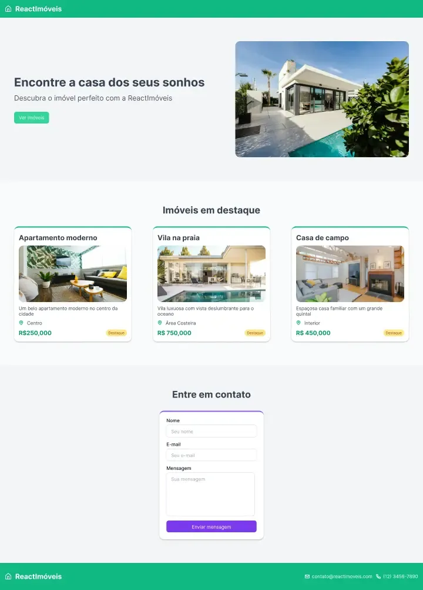

# Landing Page - ReactImóveis 🏠

- React 18
- Tailwind CSS
- [Lucide Icons](https://lucide.dev/icons/)
- Vite

### Foco do estudo

- Componentização em React
- `Props` e `State`
- Tipos de formulários
- `useEffect` e fetch de dados
- Context API
- Hooks customizados

### Preview

https://pedroncios.github.io/workshop-react-codante/

